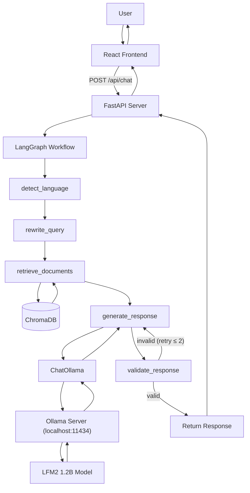
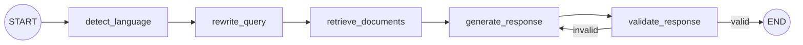

# Zucchini

**Multilingual Intelligence Assistant** — A RAG-powered conversational AI chatbot supporting English, Hindi, and Hinglish, built with FastAPI, LangGraph, ChromaDB, and React.

Zucchini demonstrates practical NLP, multilingual embeddings, retrieval-augmented generation, stateful LLM orchestration, and clean full-stack software architecture. Built as an interview-defensible AIML portfolio project.

---

## Features

- **Multilingual Conversation** — Communicate naturally in English, Hindi, or Hinglish
- **Automatic Language Detection** — Three-tier detection: Devanagari script check → Hinglish heuristic → langdetect fallback
- **Retrieval-Augmented Generation** — Answers grounded in a knowledge base, reducing hallucination
- **Multilingual Embeddings** — Cross-lingual semantic search using `paraphrase-multilingual-MiniLM-L12-v2`
- **LangGraph Orchestration** — Explicit, stateful workflow graph with conditional retry logic
- **Query Rewriting** — Contextual queries resolved using conversation history
- **Conversation Memory** — Session-based context for multi-turn dialogue
- **Response Validation** — Lightweight checks with controlled retry and fallback
- **Anti-Hallucination Design** — Honest acknowledgment when knowledge base lacks information
- **Clean REST API** — FastAPI with Pydantic request/response models
- **Minimal Dark UI** — Typography-focused React interface

---

## Architecture



### LangGraph Workflow



---

## Tech Stack

| Layer | Technology | Purpose |
|-------|-----------|---------|
| Frontend | React + Vite | Minimal chat interface |
| Backend | FastAPI + Uvicorn | REST API server |
| Orchestration | LangGraph | Stateful workflow graph |
| LLM | OpenAI API (gpt-4o-mini) | Response generation, query rewriting |
| Embeddings | sentence-transformers | Multilingual vector representations |
| Vector DB | ChromaDB | Local persistent vector storage |
| Language Detection | langdetect + custom heuristics | English / Hindi / Hinglish classification |

---

## How It Works

### 1. Language Detection
When a message arrives, the system identifies whether it's English, Hindi, or Hinglish using a three-tier approach:
- **Script check**: If significant Devanagari characters (≥30%), classify as Hindi
- **Hinglish heuristic**: If Latin script contains ≥2 common romanized Hindi words (kya, hai, kaise, etc.), classify as Hinglish
- **Fallback**: Use the `langdetect` library; if uncertain, default to English

### 2. Query Rewriting
For follow-up questions ("Why is it useful?" after discussing RAG), the LLM rewrites the query to be standalone ("Why is Retrieval-Augmented Generation useful?") using conversation history. Simple standalone queries are passed through unchanged.

### 3. Multilingual Embeddings
The `paraphrase-multilingual-MiniLM-L12-v2` model maps text from 50+ languages into a shared 384-dimensional vector space. This means "What is RAG?", "RAG kya hai?", and "RAG क्या है?" all produce similar vectors — enabling cross-lingual retrieval without translation.

### 4. Vector Retrieval
Knowledge base documents are chunked, embedded, and stored in ChromaDB during startup. At query time, the rewritten query is embedded and compared against stored chunks using cosine similarity. The top-K most relevant chunks are retrieved.

### 5. RAG Generation
Retrieved chunks are injected into the LLM prompt as context. The system prompt instructs the model to: use retrieved context as the primary source, match the user's language, acknowledge when information is unavailable, and keep responses concise.

### 6. Response Validation
A lightweight validation node checks that the response exists, isn't empty, and has sufficient length for knowledge-grounded queries. If validation fails, the system retries generation (max 2 times) before falling back to a safe multilingual error message.

### 7. Conversation Context
The frontend maintains conversation history and sends it with each request. The backend uses this history for query rewriting and includes recent messages in the LLM prompt for continuity.

---

## Project Structure

```
zucchini/
├── backend/
│   ├── app/
│   │   ├── __init__.py
│   │   ├── main.py              # FastAPI entry point, startup logic
│   │   ├── config.py            # Central configuration (env vars)
│   │   │
│   │   ├── api/
│   │   │   ├── __init__.py
│   │   │   └── chat.py          # /api/health, /api/chat endpoints
│   │   │
│   │   ├── graph/
│   │   │   ├── __init__.py
│   │   │   ├── state.py         # GraphState TypedDict definition
│   │   │   ├── nodes.py         # 5 LangGraph node functions
│   │   │   └── workflow.py      # Graph compilation and execution
│   │   │
│   │   ├── rag/
│   │   │   ├── __init__.py
│   │   │   ├── embeddings.py    # Multilingual embedding function
│   │   │   ├── ingest.py        # Document chunking and ingestion
│   │   │   └── retriever.py     # Vector similarity search
│   │   │
│   │   └── services/
│   │       ├── __init__.py
│   │       ├── llm.py           # OpenAI LLM abstraction
│   │       └── language.py      # Language detection service
│   │
│   ├── data/knowledge/          # Knowledge base documents
│   ├── chroma_db/               # Persistent vector database (gitignored)
│   ├── tests/                   # pytest test suite
│   ├── requirements.txt
│   ├── .env.example
│   └── .gitignore
│
├── frontend/
│   ├── src/
│   │   ├── components/
│   │   │   ├── Header.jsx
│   │   │   ├── ChatWindow.jsx
│   │   │   ├── MessageBubble.jsx
│   │   │   └── ChatInput.jsx
│   │   ├── services/
│   │   │   └── api.js
│   │   ├── App.jsx
│   │   ├── main.jsx
│   │   └── index.css
│   ├── package.json
│   └── vite.config.js
│
├── docs/
│   └── interview.md
├── README.md
└── .gitignore
```

---

## Setup

### Prerequisites
- Python 3.10+
- Node.js 18+
- [Ollama](https://ollama.com) (for local model inference) OR an OpenAI API Key

---

## Running Zucchini with Local Ollama (LFM2 1.2B)

Zucchini can run 100% locally with zero cloud dependencies or API keys using Ollama and the **LFM2 1.2B** model.

### 1. Install & Start Ollama
Download and install Ollama from [ollama.com](https://ollama.com). Ensure the Ollama background service is running at `http://localhost:11434`.

### 2. Verify Available Local Model
List your locally installed models in Ollama:
```bash
ollama list
```
Verify that `lfm2-local:latest` (or your imported LFM2 model name) appears in the output:
```text
NAME                 ID              SIZE      MODIFIED
lfm2-local:latest    e10cbc0d8917    1.2 GB    ...
```

### 3. Test Model directly in Ollama
Ensure your local model responds correctly:
```bash
ollama run lfm2-local:latest "Explain LangGraph in one paragraph."
```

### 4. Install Backend Dependencies
```bash
cd backend
pip install -r requirements.txt
```

### 5. Configure `.env` for Local Ollama
Set `LLM_PROVIDER=ollama` in `backend/.env`:
```env
LLM_PROVIDER=ollama
OLLAMA_BASE_URL=http://localhost:11434
OLLAMA_MODEL=lfm2-local:latest
```
*(No OpenAI API key is required when `LLM_PROVIDER=ollama`!)*

### 6. Start FastAPI Backend
```bash
cd backend
python -m uvicorn app.main:app --reload --port 8000
```
On startup, FastAPI will automatically connect to Ollama and ingest the local knowledge base.

### 7. Start React Frontend
```bash
cd frontend
npm run dev
```
Open [http://localhost:5173](http://localhost:5173) to interact with Zucchini powered by your local LFM2 1.2B model!

---

### Backend Setup (Cloud OpenAI Fallback)

```bash
cd backend

# Create virtual environment (recommended)
python -m venv venv
venv\Scripts\activate        # Windows
# source venv/bin/activate   # macOS/Linux

# Install dependencies
pip install -r requirements.txt

# Configure environment
copy .env.example .env
# Edit .env and add your OPENAI_API_KEY
```

### Frontend Setup

```bash
cd frontend
npm install
```

---

## Environment Variables

Create `backend/.env` from the template:

| Variable | Default | Description |
|----------|---------|-------------|
| `OPENAI_API_KEY` | *(required)* | Your OpenAI API key |
| `MODEL_NAME` | `gpt-4o-mini` | LLM model to use |
| `EMBEDDING_MODEL` | `paraphrase-multilingual-MiniLM-L12-v2` | Sentence-transformer model |
| `CHROMA_PATH` | `./chroma_db` | ChromaDB storage path |
| `TOP_K` | `4` | Number of chunks to retrieve |
| `MAX_HISTORY` | `10` | Max conversation messages for context |

---

## Running the Backend

```bash
cd backend
uvicorn app.main:app --reload
```

The server starts at `http://localhost:8000`. On first run, the embedding model (~420MB) will be downloaded and the knowledge base will be ingested into ChromaDB.

---

## Running the Frontend

```bash
cd frontend
npm run dev
```

The frontend starts at `http://localhost:5173` with API requests proxied to the backend.

---

## Example Queries

**English:**
```
What is retrieval augmented generation?
How do embeddings work?
Explain the difference between CNNs and RNNs.
```

**Hindi:**
```
रिट्रीवल ऑगमेंटेड जनरेशन क्या है?
मशीन लर्निंग क्या है?
Python के क्या फायदे हैं?
```

**Hinglish:**
```
RAG kya hota hai aur ye useful kyun hai?
Machine learning kya hoti hai?
LangGraph kaise kaam karta hai?
```

**Multi-turn conversation:**
```
User: What is RAG?
Assistant: RAG stands for Retrieval-Augmented Generation...
User: Why is it better than fine-tuning?
(The system resolves "it" to RAG using conversation context)
```

---

## Design Decisions

### Why LangGraph?
Makes the processing pipeline explicit and stateful. Instead of hiding logic in nested function calls, each step (detect → rewrite → retrieve → generate → validate) is a visible node in a graph. The conditional retry edge after validation demonstrates LangGraph's value over simple linear chains.

### Why RAG instead of fine-tuning?
RAG is cheaper (no retraining), updatable (add/remove documents without touching the model), and transparent (you can inspect what was retrieved). Fine-tuning bakes knowledge into model weights, which is expensive and opaque.

### Why ChromaDB?
Lightweight, runs locally with no infrastructure, persists to disk, and supports custom embedding functions. Ideal for an MVP. A production system might use Pinecone or Qdrant for scalability.

### Why multilingual embeddings?
Translation pipelines add latency and lose nuance — especially for Hinglish, which has no standard translation pipeline. Multilingual embeddings directly map semantically similar content from different languages into the same vector space.

### Why FastAPI?
Modern Python web framework with automatic OpenAPI documentation, Pydantic validation, async support, and excellent developer experience. The natural choice for a Python AI backend.

### Why React + Vite?
React provides a component-based architecture for the chat UI. Vite offers fast development server with HMR and simple configuration. No heavier framework (Next.js) is needed for a single-page chat interface.

---

## Limitations

Be honest about what this project does and doesn't do:

- **Hinglish detection is imperfect.** The heuristic approach uses keyword matching, which can produce false positives/negatives. There is no industry-standard Hinglish detector.
- **Small knowledge base.** Only 6 documents covering AI/ML topics. Retrieval quality depends on coverage.
- **Local vector database.** ChromaDB runs locally. Not suitable for production multi-user deployments without migration to a managed service.
- **LLM-dependent response quality.** Answers are only as good as the underlying model (gpt-4o-mini by default).
- **No authentication.** No user accounts, sessions, or access control.
- **Character-based chunking.** Simple chunking strategy. Production systems benefit from sentence-aware or semantic chunking.
- **No streaming.** Responses are returned in full after generation completes. Users wait for the entire response.
- **No evaluation metrics.** Retrieval and generation quality have not been quantitatively measured.

---

## Future Improvements

- Additional Indian languages (Tamil, Telugu, Bengali, etc.)
- Speech input/output integration
- Better code-switching detection using ML classifiers
- Retrieval reranking (cross-encoder scoring)
- Hybrid retrieval (keyword + semantic)
- Streaming responses via WebSocket or SSE
- Evaluation dataset for retrieval and generation quality
- Persistent user memory across sessions
- Document upload for custom knowledge bases
- Deployment configuration (Docker, cloud)

---

## Testing

```bash
cd backend
pytest tests/ -v
```

Tests cover:
- Language detection (English, Hindi, Hinglish, edge cases)
- API endpoints (health check, input validation)
- Document retrieval (cross-lingual, top-K, empty queries)

Live LLM tests are automatically skipped when `OPENAI_API_KEY` is not set.

---

## License

This project was built as a learning and portfolio project. Feel free to study, modify, and build upon it.
